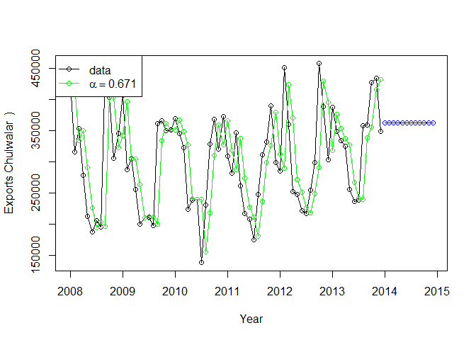
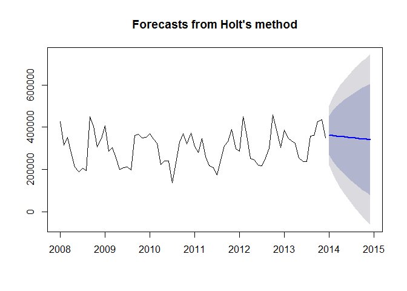
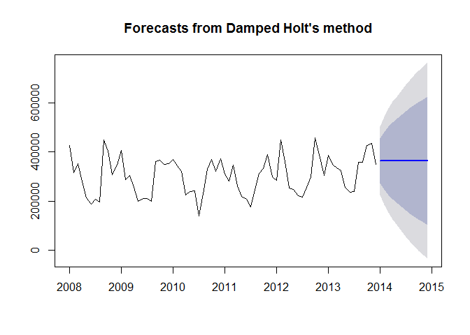
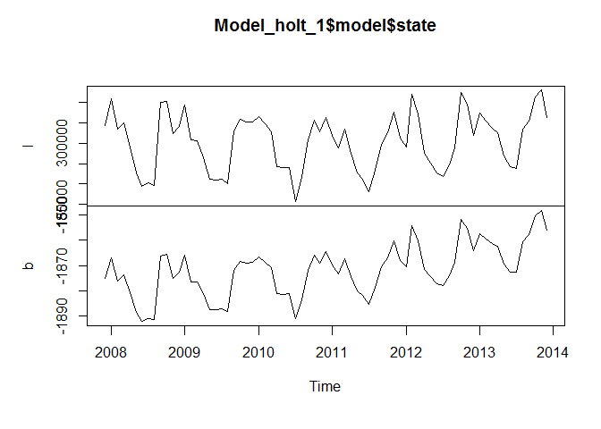

# Chulwalar Case Study
Aravind Veluchamy & Sandhya Amaresh  
July 27, 2016  


## R Markdown

Chulwalar case study - In this case study, we analyse the data for Blue Etel flower and build a forecast model based on the timeseries data for the same

Steps:
1 - Data extraction and clean up
2 - Exploratory data analysis
3 - Correration 
4 - Forecast Model , comparision
5 - Results

### 1 - Data extraction and clean up
#### Read the As Is, Planned & Indicators files from the DataFiles directory into a dataframe
#### Spilt and extract the data for Blue Etel from the AsIs and Plan Dataframes 
#### Transform the data to a timeseries object

```r
setwd("C:/Users/samaresh/SMU/Doing Data Science/ChulwalarCaseStudy")
ImportedAsIsData <- read.csv("DataFiles/ImportedAsIsDataChulwalar.csv", header = F, sep=";", fill = T) 
ImportedPlanData <- read.csv("DataFiles/ImportedPlanDataChulwalar.csv", header = F, sep=";", fill = T) 
ImportedIndicators <- read.csv("DataFiles/ImportedIndicatorsChulwalar.csv", header = F, sep=";", fill = T) 


BlueEtelAsIsVector <- c(ImportedAsIsData [58:69,2],ImportedAsIsData [58:69,3],ImportedAsIsData [58:69,4],ImportedAsIsData [58:69,5],ImportedAsIsData [58:69,6],ImportedAsIsData [58:69,7])
BlueEtelPlanVector <- c(ImportedPlanData[58:69,2],ImportedPlanData[58:69,3],ImportedPlanData[58:69,4],ImportedPlanData[58:69,5],ImportedPlanData[58:69,6],ImportedPlanData[58:69,7])
RedEtelPlanVector <- c(ImportedPlanData[72:83,2],ImportedPlanData[72:83,3],ImportedPlanData[72:83,4],ImportedPlanData[72:83,5],ImportedPlanData[72:83,6],ImportedPlanData[72:83,7])


BlueEtelAsIs <- ts(BlueEtelAsIsVector, start=c(2008,1), end=c(2013,12), frequency=12)
BlueEtelPlan <- ts(BlueEtelPlanVector, start=c(2008,1), end=c(2013,12), frequency=12)
```

### 2 - Exploratory Data Analysis
#### Plot the ts for AsIs and Planned Data 
#### Obtain a correlation b/w the AsIs and Planned
#### Decompose the TS using STL to analyse the seasonal, trend and irregular components


```r
library(fpp)
```

```
## Warning: package 'fpp' was built under R version 3.3.1
```

```
## Loading required package: forecast
```

```
## Warning: package 'forecast' was built under R version 3.3.1
```

```
## Loading required package: zoo
```

```
## Warning: package 'zoo' was built under R version 3.3.1
```

```
## 
## Attaching package: 'zoo'
```

```
## The following objects are masked from 'package:base':
## 
##     as.Date, as.Date.numeric
```

```
## Loading required package: timeDate
```

```
## This is forecast 7.1
```

```
## Loading required package: fma
```

```
## Warning: package 'fma' was built under R version 3.3.1
```

```
## Loading required package: tseries
```

```
## Warning: package 'tseries' was built under R version 3.3.1
```

```
## Loading required package: expsmooth
```

```
## Warning: package 'expsmooth' was built under R version 3.3.1
```

```
## Loading required package: lmtest
```

```
## Warning: package 'lmtest' was built under R version 3.3.1
```

```r
options(scipen = 5)
par(mfrow=c(1,2))
plot(BlueEtelAsIs, col="orange", main="BlueEtelAsIs")
plot(BlueEtelPlan, col="orange", main="BlueEtelPlan")
```

<!-- -->

```r
cor(BlueEtelAsIs , BlueEtelPlan)
```

```
## [1] 0.8044146
```

```r
# The results show a very high planning accuracy. 
BlueEltelAsIs_lm <- lm(BlueEtelAsIs ~ BlueEtelPlan , data = BlueEtelAsIs)
summary(BlueEltelAsIs_lm)
```

```
## 
## Call:
## lm(formula = BlueEtelAsIs ~ BlueEtelPlan, data = BlueEtelAsIs)
## 
## Residuals:
##     Min      1Q  Median      3Q     Max 
## -113435  -28808   -1645   27159  114404 
## 
## Coefficients:
##                 Estimate  Std. Error t value Pr(>|t|)    
## (Intercept)  73380.06135 21027.33563    3.49 0.000841 ***
## BlueEtelPlan     0.67601     0.05967   11.33  < 2e-16 ***
## ---
## Signif. codes:  0 '***' 0.001 '**' 0.01 '*' 0.05 '.' 0.1 ' ' 1
## 
## Residual standard error: 45500 on 70 degrees of freedom
## Multiple R-squared:  0.6471,	Adjusted R-squared:  0.642 
## F-statistic: 128.3 on 1 and 70 DF,  p-value: < 2.2e-16
```

```r
BlueEtelAsIs_tslm <- tslm(BlueEtelAsIs ~ BlueEtelPlan )
summary(BlueEltelAsIs_lm)
```

```
## 
## Call:
## lm(formula = BlueEtelAsIs ~ BlueEtelPlan, data = BlueEtelAsIs)
## 
## Residuals:
##     Min      1Q  Median      3Q     Max 
## -113435  -28808   -1645   27159  114404 
## 
## Coefficients:
##                 Estimate  Std. Error t value Pr(>|t|)    
## (Intercept)  73380.06135 21027.33563    3.49 0.000841 ***
## BlueEtelPlan     0.67601     0.05967   11.33  < 2e-16 ***
## ---
## Signif. codes:  0 '***' 0.001 '**' 0.01 '*' 0.05 '.' 0.1 ' ' 1
## 
## Residual standard error: 45500 on 70 degrees of freedom
## Multiple R-squared:  0.6471,	Adjusted R-squared:  0.642 
## F-statistic: 128.3 on 1 and 70 DF,  p-value: < 2.2e-16
```

```r
BlueEtelAsIs_stl <- stl(BlueEtelAsIs , s.window=5)

par(mfrow=c(3,2))

plot(BlueEtelAsIs_stl, col="black", main="BlueEtelAsIs_stl")
```

<!-- -->

```r
par(mfrow=c(1,2))

plot(BlueEtelAsIs_stl$time.series[,"trend"], col="orange")

monthplot(BlueEtelAsIs_stl$time.series[,"seasonal"], main="", ylab="Seasonal")
```

<!-- -->

#### Based on the above plots we observer the following -
#### The STL decompose the BlueEtelAsIs data into 4 plots - the Observed, Seasonal, Trend and Random
#### From the Trend plot we can see a -ve trend in the export of Blue Etel from 2008 to 2011, and the trend becomes positive from 2011 thru 2013
#### From the seasonal plot we can see that the exports fall during summer and then after the exquinox around Sept the exports pick up and we see a small reduction in exports during december which coincides with the indpendence day celebrations and again rises till march equinox


### 4 - Forecast Models and Comparisons
#### Model 1 - Simple exponential smoothing
#### In this model the past values are used to calculate a forecast. The strength with which each value influences the forecast is weakened with help of a smoothing parameter. Thus we are dealing with a weighted average, whose values fade out the longer ago they were in the past.

```r
Model_ses <- ses(BlueEtelAsIs, h=12)
summary(Model_ses)
```

```
## 
## Forecast method: Simple exponential smoothing
## 
## Model Information:
## Simple exponential smoothing 
## 
## Call:
##  ses(x = BlueEtelAsIs, h = 12) 
## 
##   Smoothing parameters:
##     alpha = 0.8334 
## 
##   Initial states:
##     l = 408394.1457 
## 
##   sigma:  70981.47
## 
##      AIC     AICc      BIC 
## 1920.425 1920.599 1924.978 
## 
## Error measures:
##                     ME     RMSE      MAE       MPE     MAPE     MASE
## Training set -767.1101 70981.47 53616.29 -3.404286 17.92757 1.390924
##                    ACF1
## Training set 0.02775223
## 
## Forecasts:
##          Point Forecast     Lo 80    Hi 80      Lo 95    Hi 95
## Jan 2014       362361.9 271395.50 453328.3 223240.791 501483.0
## Feb 2014       362361.9 243944.25 480779.6 181257.724 543466.1
## Mar 2014       362361.9 221753.95 502969.9 147320.595 577403.2
## Apr 2014       362361.9 202616.95 522106.9 118053.073 606670.8
## May 2014       362361.9 185539.10 539184.7  91934.750 632789.1
## Jun 2014       362361.9 169971.26 554752.6  68125.798 656598.0
## Jul 2014       362361.9 155572.12 569151.7  46104.214 678619.6
## Aug 2014       362361.9 142112.34 582611.5  25519.259 699204.6
## Sep 2014       362361.9 129429.03 595294.8   6121.805 718602.0
## Oct 2014       362361.9 117401.54 607322.3 -12272.650 736996.5
## Nov 2014       362361.9 105937.58 618786.3 -29805.266 754529.1
## Dec 2014       362361.9  94964.65 629759.2 -46586.907 771310.7
```

```r
plot(Model_ses)
```

<!-- -->
#### The Akaike's Information Criterion(AIC/AICc) or the Bayesian Information 
#### Criterion (BIC) should be at minimum.

```r
plot(Model_ses, plot.conf=FALSE, ylab="Exports Chulwalar  )", xlab="Year", main="", fcol="white", type="o")
lines(fitted(Model_ses), col="green", type="o")
lines(Model_ses$mean, col="blue", type="o")
legend("topleft",lty=1, col=c(1,"green"), c("data", expression(alpha == 0.671)),pch=1)
```

<!-- -->

#### Model 2 - HOlt's Linear Method
#### This model in addition to SES model uses the trend as well. When neither alpha nor beta are provided, they paramets are optimised

```r
Model_holt_1 <- holt(BlueEtelAsIs,h=12)
summary(Model_holt_1)
```

```
## 
## Forecast method: Holt's method
## 
## Model Information:
## Holt's method 
## 
## Call:
##  holt(x = BlueEtelAsIs, h = 12) 
## 
##   Smoothing parameters:
##     alpha = 0.8116 
##     beta  = 0.0001 
## 
##   Initial states:
##     l = 344604.6379 
##     b = -1875.0926 
## 
##   sigma:  71420.77
## 
##      AIC     AICc      BIC 
## 1925.314 1925.911 1934.420 
## 
## Error measures:
##                    ME     RMSE      MAE       MPE     MAPE     MASE
## Training set 2631.588 71420.77 54188.46 -2.385174 17.95402 1.405767
##                    ACF1
## Training set 0.02887155
## 
## Forecasts:
##          Point Forecast     Lo 80    Hi 80      Lo 95    Hi 95
## Jan 2014       361745.3 270215.93 453274.7 221763.185 501727.5
## Feb 2014       359889.2 241995.14 477783.2 179585.809 540192.6
## Mar 2014       358033.0 218671.14 497394.9 144897.413 571168.7
## Apr 2014       356176.9 198234.40 514119.4 114624.694 597729.1
## May 2014       354320.8 179760.49 528881.0  87353.863 621287.6
## Jun 2014       352464.6 162732.95 542196.3  62295.078 642634.1
## Jul 2014       350608.5 146828.49 554388.4  38953.885 662263.0
## Aug 2014       348752.3 131828.79 565675.8  16996.416 680508.2
## Sep 2014       346896.2 117578.24 576214.1  -3815.341 697607.7
## Oct 2014       345040.0 103961.25 586118.8 -23658.138 713738.2
## Nov 2014       343183.9  90889.22 595478.5 -42667.506 729035.3
## Dec 2014       341327.7  78292.42 604363.1 -60950.071 743605.5
```

```r
plot(Model_holt_1)
```

<!-- -->

####  The trend is exponential if the intercepts(level) and the gradient (slope) are
####  multiplied with eachother. The values are worse. As the Beta was very low in 
####  the optimisation, the forecast is very similar to the ses() model. 


```r
Model_holt_2<- holt(BlueEtelAsIs, exponential=TRUE,h=12)
summary(Model_holt_2)
```

```
## 
## Forecast method: Holt's method with exponential trend
## 
## Model Information:
## Holt's method with exponential trend 
## 
## Call:
##  holt(x = BlueEtelAsIs, h = 12, exponential = TRUE) 
## 
##   Smoothing parameters:
##     alpha = 0.8233 
##     beta  = 0.0001 
## 
##   Initial states:
##     l = 344616.7087 
##     b = 0.9822 
## 
##   sigma:  0.287
## 
##      AIC     AICc      BIC 
## 1946.718 1947.315 1955.824 
## 
## Error measures:
##                    ME     RMSE      MAE        MPE     MAPE   MASE
## Training set 6767.601 71076.53 53495.88 -0.9592992 17.56174 1.3878
##                   ACF1
## Training set 0.0174015
## 
## Forecasts:
##          Point Forecast     Lo 80    Hi 80     Lo 95     Hi 95
## Jan 2014       355234.5 221714.94 487760.4 155269.98  556247.3
## Feb 2014       349026.0 187988.70 537122.9 122856.30  641965.2
## Mar 2014       342925.9 164034.62 555802.5 101840.92  709693.2
## Apr 2014       336932.5 143367.16 577808.6  88813.17  773761.7
## May 2014       331043.9 127904.25 594013.1  74908.28  821326.9
## Jun 2014       325258.1 110787.91 614899.4  63508.44  867956.1
## Jul 2014       319573.5  98608.22 615999.0  55091.24  907402.4
## Aug 2014       313988.2  91536.44 629241.4  46323.78  999398.5
## Sep 2014       308500.6  81344.11 623140.1  41786.50  983437.5
## Oct 2014       303108.8  72270.91 631024.6  36921.35 1029635.0
## Nov 2014       297811.3  67378.68 626703.6  34098.28 1032555.7
## Dec 2014       292606.4  62052.67 628448.7  30343.97 1066856.0
```

```r
plot(Model_holt_2)
```

<!-- -->
####  As such simple trends tend to forecast the future to positively, we have added a dampener.
#### Similar values to that of Model_holt_1 

```r
Model_holt_3 <- holt(BlueEtelAsIs, damped=TRUE,h=12)
summary(Model_holt_3)
```

```
## 
## Forecast method: Damped Holt's method
## 
## Model Information:
## Damped Holt's method 
## 
## Call:
##  holt(x = BlueEtelAsIs, h = 12, damped = TRUE) 
## 
##   Smoothing parameters:
##     alpha = 0.8074 
##     beta  = 0.0001 
##     phi   = 0.9271 
## 
##   Initial states:
##     l = 344604.6786 
##     b = -1874.3426 
## 
##   sigma:  71352.88
## 
##      AIC     AICc      BIC 
## 1927.177 1928.086 1938.560 
## 
## Error measures:
##                   ME     RMSE      MAE       MPE     MAPE     MASE
## Training set 747.895 71352.88 54509.17 -3.060054 18.15212 1.414087
##                    ACF1
## Training set 0.03120472
## 
## Forecasts:
##          Point Forecast    Lo 80    Hi 80      Lo 95    Hi 95
## Jan 2014       364346.3 272903.9 455788.7 224497.219 504195.4
## Feb 2014       364343.7 246805.9 481881.4 184585.239 544102.1
## Mar 2014       364341.2 225526.3 503156.2 152042.054 576640.4
## Apr 2014       364338.9 207096.9 521581.0 123857.946 604819.9
## May 2014       364336.8 190608.7 538065.0  98642.557 630031.1
## Jun 2014       364334.9 175552.6 553117.1  75617.379 653052.4
## Jul 2014       364333.1 161609.6 567056.5  54294.358 674371.8
## Aug 2014       364331.4 148564.0 580098.8  34343.611 694319.1
## Sep 2014       364329.8 136261.7 592397.9  15529.796 713129.8
## Oct 2014       364328.4 124588.6 604068.1  -2321.962 730978.7
## Nov 2014       364327.0 113456.8 615197.2 -19345.817 747999.9
## Dec 2014       364325.8 102797.4 625854.2 -35647.355 764298.9
```

```r
plot(Model_holt_3)
```

<!-- -->
####  This also works for exponential trends. 
####  The values remain worse. 

```r
Model_holt_4 <- holt(BlueEtelAsIs, exponential=TRUE, damped=TRUE,h=12)
summary(Model_holt_4)
```

```
## 
## Forecast method: Damped Holt's method with exponential trend
## 
## Model Information:
## Damped Holt's method with exponential trend 
## 
## Call:
##  holt(x = BlueEtelAsIs, h = 12, damped = TRUE, exponential = TRUE) 
## 
##   Smoothing parameters:
##     alpha = 0.7823 
##     beta  = 0.0001 
##     phi   = 0.8511 
## 
##   Initial states:
##     l = 344616.411 
##     b = 0.9384 
## 
##   sigma:  0.2806
## 
##      AIC     AICc      BIC 
## 1947.789 1948.698 1959.172 
## 
## Error measures:
##                    ME     RMSE      MAE       MPE     MAPE     MASE
## Training set 2372.313 71121.27 54593.82 -2.593024 18.12276 1.416283
##                    ACF1
## Training set 0.04579882
## 
## Forecasts:
##          Point Forecast     Lo 80    Hi 80     Lo 95     Hi 95
## Jan 2014       366201.7 234498.33 497224.2 155408.60  565038.6
## Feb 2014       366208.4 203032.18 542044.5 132944.31  654076.9
## Mar 2014       366214.1 185490.62 578404.2 118767.45  736323.5
## Apr 2014       366219.0 162607.23 602790.6 103362.00  783692.1
## May 2014       366223.1 149545.18 620984.4  94211.58  833939.8
## Jun 2014       366226.6 136817.20 642144.8  81933.41  892015.9
## Jul 2014       366229.6 125784.14 665501.2  75103.50  979967.3
## Aug 2014       366232.2 117602.67 677961.8  67081.10 1021711.1
## Sep 2014       366234.3 108849.57 715918.8  59226.26 1069837.1
## Oct 2014       366236.2 101893.18 731865.6  54864.32 1121954.3
## Nov 2014       366237.7  92548.07 749838.6  52410.50 1194024.5
## Dec 2014       366239.1  89485.03 754619.2  46051.97 1255586.9
```

```r
plot(Model_holt_4)
```

<!-- -->

####  level and slope can be plotted individually for each model.

```r
plot(Model_holt_1$model$state)
```

<!-- -->

```r
plot(Model_holt_2$model$state)
```

<!-- -->

```r
plot(Model_holt_3$model$state)
```

<!-- -->

```r
plot(Model_holt_4$model$state)
```

<!-- -->

```r
plot(Model_holt_1, plot.conf=FALSE, ylab="Exports Chulwalar  )", xlab="Year", main="", fcol="white", type="o")
lines(fitted(Model_ses), col="purple", type="o")
lines(fitted(Model_holt_1), col="blue", type="o")
lines(fitted(Model_holt_2), col="red", type="o")
lines(fitted(Model_holt_3), col="green", type="o")
lines(fitted(Model_holt_4), col="orange", type="o")
lines(Model_ses$mean, col="purple", type="o")
lines(Model_holt_1$mean, col="blue", type="o")
lines(Model_holt_2$mean, col="red", type="o")
lines(Model_holt_3$mean, col="green", type="o")
lines(Model_holt_4$mean, col="orange", type="o")
legend("topleft",lty=1, col=c(1,"purple","blue","red","green","orange"), c("data", "SES","Holts auto", "Exponential", "Additive Damped", "Multiplicative Damped"),pch=1)
```

<!-- -->

####  As these forecasts are not very convincing at the moment, there is no need 
####  to export the data.

#### Model 3 - Holt - Winter's seasonality model
#### This model expands the Holt's model to futher include the seasonality aspect
#### There are 2 models under this, the additive model and multiplicative model
#### 3.1 Additive Model

```r
Model_hw_1 <- hw(BlueEtelAsIs ,seasonal="additive",h=12)
summary(Model_hw_1)
```

```
## 
## Forecast method: Holt-Winters' additive method
## 
## Model Information:
## Holt-Winters' additive method 
## 
## Call:
##  hw(x = BlueEtelAsIs, h = 12, seasonal = "additive") 
## 
##   Smoothing parameters:
##     alpha = 0.0147 
##     beta  = 0.0147 
##     gamma = 0.0001 
## 
##   Initial states:
##     l = 313008.9319 
##     b = -1080.7413 
##     s=36712.36 53999.56 89090.19 53986.79 -68669.93 -106522.5
##            -79256.58 -69589.39 -36619.22 32948.66 42663.88 51256.12
## 
##   sigma:  37002.34
## 
##      AIC     AICc      BIC 
## 1854.618 1864.509 1891.045 
## 
## Error measures:
##                  ME     RMSE      MAE       MPE     MAPE      MASE
## Training set 4506.6 37002.34 29156.11 0.2573195 9.566305 0.7563733
##                    ACF1
## Training set -0.2436937
## 
## Forecasts:
##          Point Forecast    Lo 80    Hi 80    Lo 95    Hi 95
## Jan 2014       408230.9 360810.5 455651.3 335707.6 480754.1
## Feb 2014       403323.5 355856.9 450790.1 330729.6 475917.5
## Mar 2014       397308.5 349759.8 444857.1 324589.1 470027.9
## Apr 2014       331434.9 283758.3 379111.5 258519.9 404349.9
## May 2014       302157.1 254297.0 350017.3 228961.3 375352.9
## Jun 2014       296184.0 248075.1 344292.9 222607.8 369760.3
## Jul 2014       272617.8 224185.9 321049.8 198547.6 346688.1
## Aug 2014       314172.6 265335.0 363010.2 239481.9 388863.3
## Sep 2014       440512.9 391179.0 489846.8 365063.2 515962.6
## Oct 2014       479314.7 429386.9 529242.5 402956.7 555672.7
## Nov 2014       447923.5 397298.0 498549.0 370498.4 525348.6
## Dec 2014       434324.6 382891.4 485757.7 355664.3 512984.8
```

```r
plot(Model_hw_1)
```

<!-- -->

#### 3.2 Multiplicative Model

```r
Model_hw_2 <- hw(BlueEtelAsIs ,seasonal="multiplicative",h=12)
summary(Model_hw_2)
```

```
## 
## Forecast method: Holt-Winters' multiplicative method
## 
## Model Information:
## Holt-Winters' multiplicative method 
## 
## Call:
##  hw(x = BlueEtelAsIs, h = 12, seasonal = "multiplicative") 
## 
##   Smoothing parameters:
##     alpha = 0.015 
##     beta  = 0.015 
##     gamma = 0.0001 
## 
##   Initial states:
##     l = 308752.254 
##     b = -709.4998 
##     s=1.1117 1.1911 1.2944 1.1664 0.8046 0.6596
##            0.6946 0.7435 0.8856 1.1223 1.1276 1.1986
## 
##   sigma:  0.1218
## 
##      AIC     AICc      BIC 
## 1848.746 1858.637 1885.173 
## 
## Error measures:
##                    ME     RMSE      MAE       MPE     MAPE      MASE
## Training set 3807.777 36985.28 28863.82 0.0819902 9.553147 0.7487907
##                    ACF1
## Training set -0.2235846
## 
## Forecasts:
##          Point Forecast    Lo 80    Hi 80    Lo 95    Hi 95
## Jan 2014       435410.6 367436.5 503384.7 331453.1 539368.1
## Feb 2014       414001.1 349340.6 478661.6 315111.4 512890.8
## Mar 2014       416470.7 351360.9 481580.5 316893.8 516047.5
## Apr 2014       332085.6 280080.2 384091.1 252550.2 411621.1
## May 2014       281716.0 237484.3 325947.7 214069.5 349362.5
## Jun 2014       265920.0 224016.7 307823.3 201834.4 330005.5
## Jul 2014       255076.9 214688.8 295465.0 193308.7 316845.1
## Aug 2014       314285.4 264218.9 364351.9 237715.2 390855.6
## Sep 2014       460190.3 386332.5 534048.1 347234.6 573146.1
## Oct 2014       515758.4 432244.0 599272.9 388034.2 643482.7
## Nov 2014       479241.3 400832.9 557649.7 359326.0 599156.6
## Dec 2014       451675.7 376898.3 526453.0 337313.6 566037.8
```

```r
plot(Model_hw_2)
```

<!-- -->


```r
plot(Model_hw_1, ylab="Exports Chulwalar  ", plot.conf=FALSE, type="o", fcol="white", xlab="Year")
lines(fitted(Model_hw_1), col="red", lty=2)
lines(fitted(Model_hw_2), col="green", lty=2)
lines(Model_hw_1$mean, type="o", col="red")
lines(Model_hw_2$mean, type="o", col="green")
legend("topleft",lty=1, pch=1, col=1:3, c("data","Holt Winters' Additive","Holt Winters' Multiplicative"))
```

<!-- -->

```r
# In order to use the results later, they need to be converted into point forcasts.
Model_hw_1_df <-as.data.frame(Model_hw_1) 
Model_hw_1_PointForecast <- ts(Model_hw_1_df$"Point Forecast", start=c(2014,1), end=c(2014,12), frequency=12)
Model_hw_1_PointForecast
```

```
##           Jan      Feb      Mar      Apr      May      Jun      Jul
## 2014 408230.9 403323.5 397308.5 331434.9 302157.1 296184.0 272617.8
##           Aug      Sep      Oct      Nov      Dec
## 2014 314172.6 440512.9 479314.7 447923.5 434324.6
```

```r
Model_hw_2_df <-as.data.frame(Model_hw_2) 
Model_hw_2_PointForecast <- ts(Model_hw_2_df$"Point Forecast", start=c(2014,1), end=c(2014,12), frequency=12)
Model_hw_2_PointForecast
```

```
##           Jan      Feb      Mar      Apr      May      Jun      Jul
## 2014 435410.6 414001.1 416470.7 332085.6 281716.0 265920.0 255076.9
##           Aug      Sep      Oct      Nov      Dec
## 2014 314285.4 460190.3 515758.4 479241.3 451675.7
```

```r
# Output instruction for the data export of the results for further use in Excel.
#write.csv(Model_hw_1_PointForecast,file='Model_hw_1_PointForecast.csv')
#write.csv(Model_hw_2_PointForecast,file='Model_hw_2_PointForecast.csv')
```

### Results -
### Based on the results, we see that the multiplicative model is slightly better than the additive model.
### The above table shows the forecast numbers based on both the models
